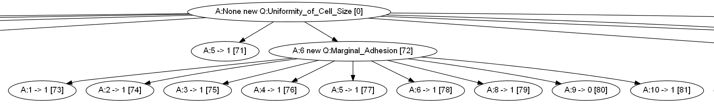

# Decision Tree Classifier
Machine Learning - Spring 2012

## What was the project assignment? 
As one of the many classifiers that we were tasked with implementing in Doug Raiford's machine learning (ML) course, the decision tree stood above the rest in my mind. A classifier is an algorithm for identifying classes (for example, benign or malignant tumors) to which data points (rows/tuples of data with one or more attributes/dimensions) belong. The decision tree is a classifier which identifies which attributes are the most important (in terms of separating by class) and orders them by importance. Our [assignment](./assignment.pdf) was to implement the decision tree classifier (DTC) and test it on a well-known set of data known as the [Breast Cancer Wisconsin (Original) Data Set](http://archive.ics.uci.edu/ml/datasets/Breast+Cancer+Wisconsin+%28Original%29), which contains 629 records with nine attributes/dimensions and two classes (benign or malignant). In the end, my classifier achieved 81% (n=70) accuracy.

## What did you learn from the project?
Apart from learning about an unexpected application of [information theory](http://en.wikipedia.org/wiki/Information_theory) (given my background in electrical engineering, I had only seen it from the signals perspective), I became aware a simple technique which encourages a symbiotic relationship between humans and computers. Decision trees are valuable classifiers because they don't just give you an answer - they provide you with a plan for how that answer was achieved. This allows humans to learn from machines, just as the computer has learned from human input.

## What are you most proud of?
A decision tree, as long as its small, is nice to see as a visual. Since a tree is just a type of [graph](http://en.wikipedia.org/wiki/Graph_theory), it made sense to me to output the tree as a graph (in the [dot language](http://www.graphviz.org/content/dot-language)) and then use [Graphviz](http://graphviz.org/) to create an image of the graph. Going the extra mile to generate this image made me quite proud. With so many dimensions in this dataset, it's harder to use [the image](./tree-pat.png) than it is the text of the tree, but on smaller datasets it is much easier to follow a tree visually.

## What would you do differently next time?
It's easy to say this in retrospect, but I would have made my functions more generic so that it was easy to run the classifier on a different dataset. During creation, it's hard to see how these classifiers can be abstracted, but the payoff in having an abstract data type is significant. In fact, I used my experience from ML in order to create a better library as I completed projects in the Pattern Recognition course, which made it significantly easier to reuse throughout the course.
