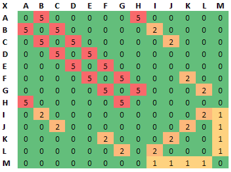

<!--  -->

## What was the project assignment? 
Dijkstra's algorithm allows one to find the shortest path from one vertex/node to another in a graph/network. For this [assignment](./assignment.pdf), we were tasked with implementing Dijkstra's algorithm and verifying its correctness on a [given graph](./graph.png). [The end product](./code/dijkstra.html) is something I'm quite proud of - an implementation utilizing the algorithm visualization library that Mike Rosulek, Eric Spaulding, and I created as part of Mike's research.

## What did you learn from the project?
I was already familiar with Dijkstra's algorithm, but this project did give me incentive to learn more about computer representations of graphs. You see, for our research project to be successful, we needed an easy way for users and authors to create graphs. As a library developer, that meant I needed to understand graphs as an abstract data type as well as knowing how to implement and store them. In this project, we were presented with an adjacency matrix, which would make sense for a heavily connected graph. So this project forced me to implement support for adjacency matrices, as well as the existing adjacency list implementation, and I learned a great deal more about graphs than I ever intended (or wanted!).

## What are you most proud of?
I was really proud that the library which we created as a research project was able to be used for a typical problem in CS. Often, when one is creating a library, it is easy to get caught up in the implementation rather than to focus on the API surface - the part that other developers interact with. This project forced me to use our library like a typical author would, and it lead to some valuable changes in the interface. But, a surprising number of design choices turned out to be appropriate and correct. (Of course, this is a biased review since I also helped develop the library.) Besides the usefulness of the library, though, I was happy that other people (students in the class) thought it would be a good tool. That made me especially proud.

## What would you do differently next time?
Given the chance, I would simplify creation of graphs. In this assignment, we were given a graph as an adjacency matrix. But it's conceivable that we would have allowed users to create their own graphs and edge values to see how the algorithm behaved. In fact, I think the majority of learning happens when the learner has control over the demo or parameters of a simulation. When you can tweak a process, it gives you a better understanding of that process. So I really would have liked to make a simple interface for users to create a test their own graphs.
