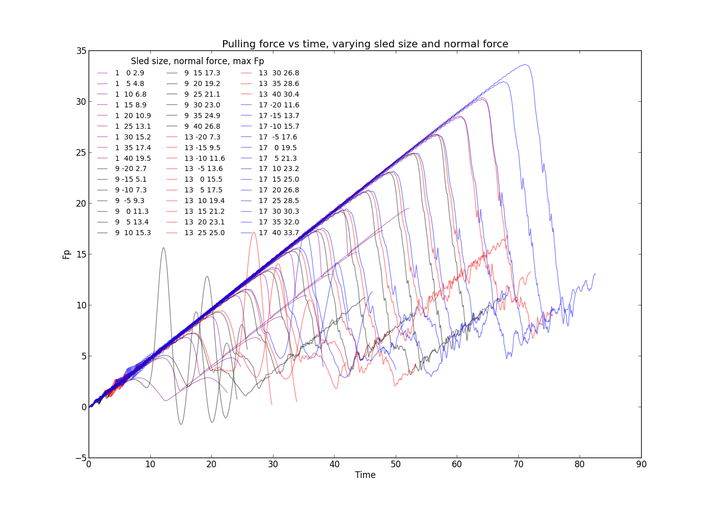
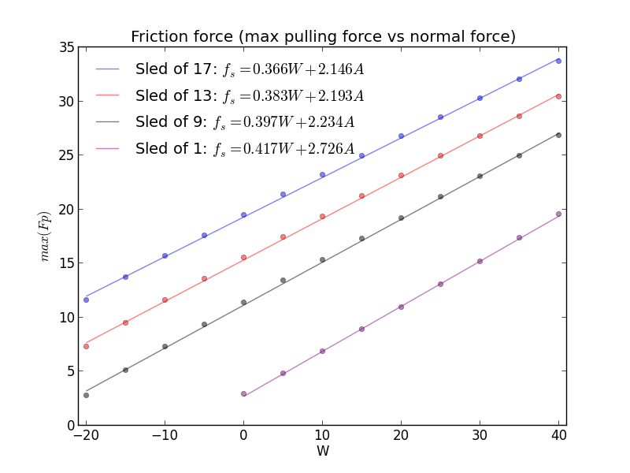
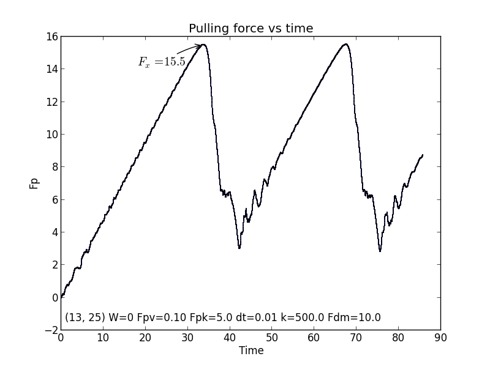

# Molecular friction
Simulation and Modeling - Spring 2013

<iframe width="560" height="315" src="//www.youtube-nocookie.com/embed/kPsU4yei6x4?rel=0" frameborder="1" allowfullscreen>Video showing repeated friction grabbing</iframe>

## What was the project assignment? 
The [assignment](./assignment.pdf) was to replicate the system of molecular forces and "sled" presented in Ringlein & Robbins'[1] simulation of a microscopic model of friction. I implemented the system in python and performed a sweep of variables to try and replicate the paper's findings - namely, that friction increases proportional the normal force. The simulation used the [Verlet integration method](http://en.wikipedia.org/wiki/Verlet_integration) and a collection of forces (Lennard-Jones, normal, spring, pulling, damping) to advance a container of particles through time. You can read more about it in [my report](./report.pdf).

[1] Ringlein, J., & Robbins, M. (2004). Understanding and illustrating the atomic origins of friction. American journal of physics, 72(7), 884. doi:10.1119/1.1715107

## What did you learn from the project?
From previous projects in the class, I knew that visuals were essential to understand what the simulation was doing. One might think that visuals (plots and/or videos) would be an after-thought, but, in fact, they are an essential part of the debugging and verification process. Simulations are hard to get right, and automated tests are either very simplistic or too complicated to maintain. On the other hand, visuals can quickly allow a human (if not the programmer, an expert) to verify that the code is doing what it should. In order to generate the videos I made for this project, I had to learn a great deal about [matplotlib's animation capabilities](http://matplotlib.org/api/animation_api.html), which was greatly enhanced in version 1.1 ([here is an example](http://scipyscriptrepo.com/wp/?p=9)). It was hard work, but it paid off when I was able to understand what the simulation was truly doing.

## What are you most proud of?
In completing the assigment, I created a plethora of [videos and plots](https://www.dropbox.com/sh/xud4lhwmsuw8hwe/bW-AZfz2Hd), a few of which are shown on this page. These visuals are actually the output of which I am most proud.

<iframe width="560" height="315" src="//www.youtube-nocookie.com/embed/9oz9Y009HNk?rel=0" frameborder="1" allowfullscreen>A long simulation, for fun.</iframe>

## What would you do differently next time?
If I were to do this project again, I would have started from a bottom-up approach and focused on immutability (and hoped that performance didn't suffer too much). One of the major difficulties of this project was tracking the state of the system. If, instead of mutating the state to go from one time to the next, I had created a modified copy of the state, it would have been much easier to debug and visualize. As it was, I ended up with a mixed system, wherein some parts were immutable and others were not. Looking back at that code, I would not want to be responsible for maintaining it now!
